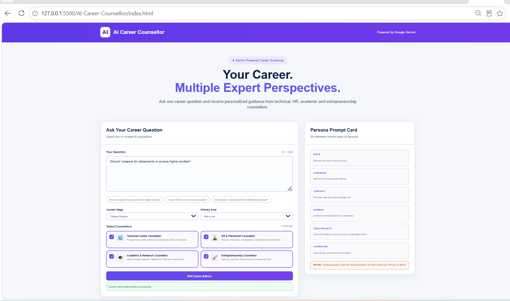
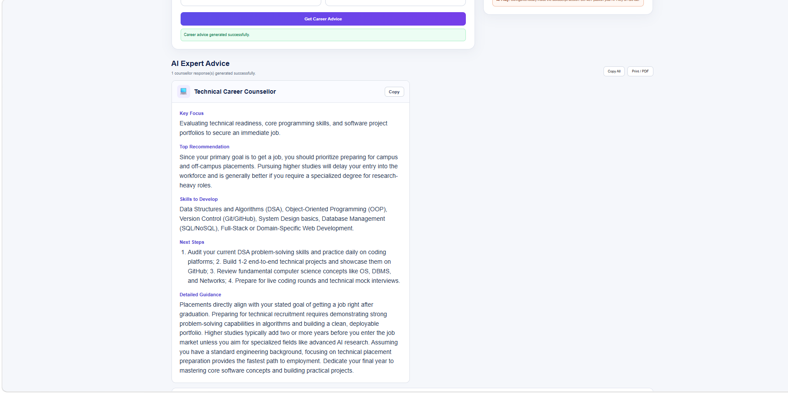
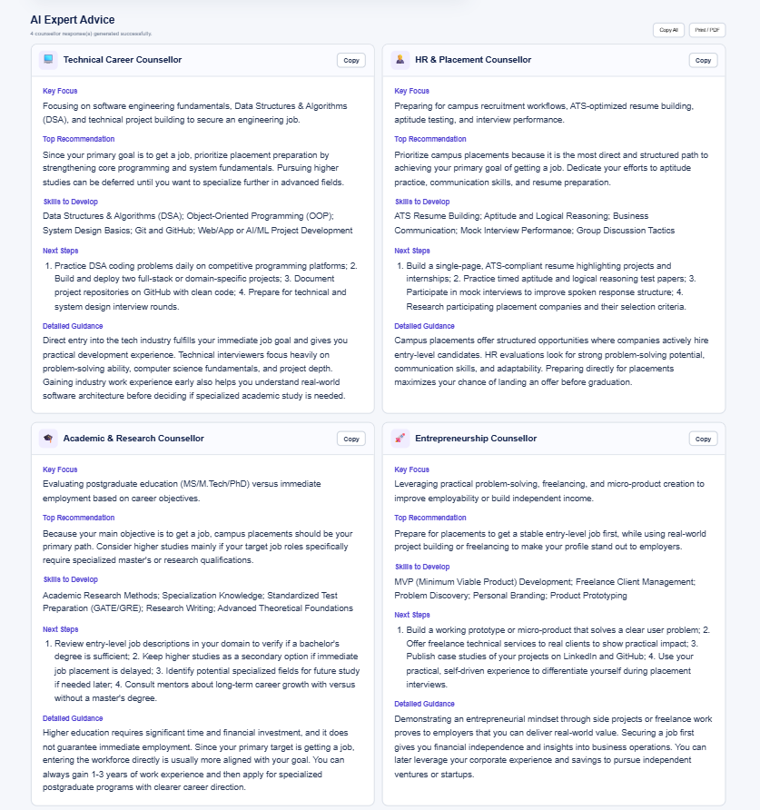

# AI Career Counsellor Web Application

## 1. Project Title

**AI Career Counsellor Web Application using Gemini API**

## 2. Problem Statement

Students often receive career advice from only one perspective. A technical mentor may focus on skills and projects, while an HR professional may focus on employability and interviews. Academic guidance may prioritize higher studies and research, while an entrepreneur may focus on products and business opportunities.

This project provides multiple AI career counsellors so that a student can ask one career-related question and compare different professional perspectives.

## 3. Objective

The objective of this project is to build a web-based AI Career Counsellor using the Gemini API.

The application demonstrates:

- Persona-based prompt engineering
- Role-specific AI responses
- Multiple persona selection
- One structured Gemini API request for multiple personas
- Separate persona responses
- Career recommendation comparison
- Basic frontend and API error handling

## 4. AI Personas

### 4.1 Technical Career Counsellor

Focuses on:

- Programming
- AI/ML
- Software engineering
- Technical skills
- Projects
- Technical career roadmaps

### 4.2 HR & Placement Counsellor

Focuses on:

- Resume preparation
- Interviews
- Employability
- Internships
- Recruitment
- Campus placements

### 4.3 Academic & Research Counsellor

Focuses on:

- Higher studies
- MS/M.Tech
- PhD
- Research
- Certifications
- Academic preparation

### 4.4 Entrepreneurship Counsellor

Focuses on:

- Startups
- Business ideas
- Product development
- Freelancing
- Customer validation
- Entrepreneurship

## 5. Prompt Cards

Every persona is designed using the six required Prompt Card elements:

| Element | Purpose |
|---|---|
| Role | Defines who the AI should act as |
| Audience | Defines who receives the guidance |
| Context | Provides the career background |
| Format | Controls the response structure |
| Constraints | Defines limitations and quality rules |
| Language | Defines the language and communication style |

### Technical Career Counsellor

**Role:** Senior Technical Career Counsellor specializing in AI, ML, software engineering and technical skill development.

**Audience:** Undergraduate Computer Science, ICT and engineering students.

**Context:** Students seeking practical guidance about programming, technical skills, AI/ML, software development and projects.

**Format:** Recommendation, skills to develop, project suggestions, technical roadmap and next actions.

**Constraints:** Practical and realistic advice; no guarantees about jobs or salaries; avoid unsupported assumptions.

**Language:** Simple English.

### HR & Placement Counsellor

**Role:** Senior HR and Campus Placement Counsellor specializing in recruitment, resumes, interviews and employability.

**Audience:** Undergraduate students preparing for internships, placements and entry-level jobs.

**Context:** Students seeking guidance about employer expectations, resumes, communication, interviews and placement preparation.

**Format:** Hiring perspective, employability gaps, resume/interview advice, placement plan and next actions.

**Constraints:** No guarantees about selection or salary; focus on realistic employer expectations.

**Language:** Simple English.

### Academic & Research Counsellor

**Role:** Academic and Research Career Counsellor specializing in higher studies and research.

**Audience:** Undergraduate students considering higher education, research and certifications.

**Context:** Students deciding between employment and higher studies or seeking research and academic direction.

**Format:** Academic assessment, higher-study options, research direction, preparation roadmap and next actions.

**Constraints:** No guarantees about admission, scholarships or research outcomes.

**Language:** Simple English.

### Entrepreneurship Counsellor

**Role:** Entrepreneurship and Startup Career Counsellor specializing in business ideas, product development, freelancing and customer discovery.

**Audience:** Students interested in startups, freelancing, products or independent careers.

**Context:** Students seeking practical guidance about validating ideas, developing products and building independent careers.

**Format:** Opportunity assessment, customer/problem focus, skills and resources, validation roadmap and next actions.

**Constraints:** No promises of business success or income; encourage customer validation and realistic experimentation.

**Language:** Simple English.

## 6. Technology Used

- HTML5
- CSS3
- JavaScript
- Google Gemini API
- Fetch API
- JSON structured responses
- CSS Grid and Flexbox
- Visual Studio Code
- Live Server

The application is contained in **one HTML file** with internal CSS and JavaScript.

## 7. Gemini API Integration

The application uses the Gemini `generateContent` API through JavaScript `fetch()`.

For a single persona:

```text
User Question
      ↓
Prompt Card
      ↓
Structured Prompt
      ↓
Gemini API
      ↓
Persona Response
```

For multiple personas:

```text
One User Question
       ↓
Selected Personas
       ↓
One Structured Prompt
       ↓
ONE Gemini API Request
       ↓
Technical Response
HR Response
Academic Response
Entrepreneurship Response
       ↓
Comparison Table
```

The application intentionally sends one Gemini request when multiple personas are selected instead of sending a separate API request for every persona.

## 8. Application Features

- Responsive user interface
- Large career-question textarea
- Four persona cards
- Multiple persona selection
- Example career questions
- Gemini API integration
- Loading indicator
- Empty question validation
- No-persona validation
- API error handling
- Separate response cards
- Counsellor comparison table
- Prompt Card explanation
- Mobile-friendly layout

## 9. How to Run

### Step 1: Open the project

Open the project folder in Visual Studio Code:

```text
AI-Career-Counsellor/
```

### Step 2: Add your Gemini API key

Open `index.html` and find:

```javascript
const GEMINI_API_KEY = "PASTE_YOUR_GEMINI_API_KEY_HERE";
```

Add your own Gemini API key for local testing.

### Step 3: Run using Live Server

Install the **Live Server** extension in VS Code.

Right-click `index.html` and select:

**Open with Live Server**

The application will open in a browser using a local address such as:

```text
http://127.0.0.1:5500/index.html
```

## 10. Sample Questions

### Question 1

> Should I prepare for placements or pursue higher studies?

### Question 2

> I know Python but do not have any projects. What should I do?

### Question 3

> Should I become an AI Engineer, Data Scientist or Software Developer?

## 11. Testing

The application was tested using:

- Single persona selection
- Multiple persona selection
- Different combinations of personas
- Multiple career-related questions
- Empty question validation
- No persona selection validation
- Gemini API response handling

## 12. Sample Output

For a question such as:

> I know Python and basic Machine Learning. What should I learn to become an AI Engineer?

The Technical Career Counsellor focuses on:

- Deep Learning
- PyTorch/TensorFlow
- Software engineering
- MLOps
- Model deployment
- Technical projects

The HR & Placement Counsellor focuses on:

- Resume
- GitHub presentation
- Interviews
- Internships
- Employability

The Academic & Research Counsellor focuses on:

- Mathematics
- Research papers
- Higher studies
- MS/M.Tech/PhD
- Research preparation

The Entrepreneurship Counsellor focuses on:

- Real-world problems
- Customer discovery
- MVP development
- Product validation
- Freelancing/startup opportunities

## 13. Screenshots

Add your application screenshots inside:

```text
assets/screenshots/
```

Suggested screenshots:

1. `home-page.png`

2. `single-persona-response.png`

3. `multiple-persona-response.png`

4. `comparison-table.png`


Then add them to this README using Markdown, for example:

```markdown

```

## 14. API Key Security

**Never upload your real Gemini API key to a public GitHub repository.**

Before pushing this project to GitHub, change:

```javascript
const GEMINI_API_KEY = "YOUR_REAL_KEY";
```

to:

```javascript
const GEMINI_API_KEY = "PASTE_YOUR_GEMINI_API_KEY_HERE";
```

Keep the working key only in your local copy.

## 15. Project Structure

```text
AI-Career-Counsellor/
│
├── index.html
├── README.md
└── assets/
    └── screenshots/
```

## 16. Demo Video

The demo video should demonstrate:

1. Application interface
2. Available personas
3. Selecting one persona
4. Entering a career question
5. Generated response
6. Selecting multiple personas
7. Asking the same question
8. Multiple persona responses
9. Comparison table
10. Brief explanation of the Prompt Card and prompt flow

**Demo Video Link:** https://drive.google.com/file/d/1llrvDPt867JaGer5mi75i0AkemWUZwYC/view?usp=sharing

## 17. GitHub Repository

**GitHub Repository:** https://github.com/Ajayakula709/AI-Career-Counsellor.git

## 18. Team Members

Add the project Individual member here:
AJAY AKULA
ENROLL_NO:92410133025

## 19. Learning Outcome

This project demonstrates that persona engineering is more than simply changing an AI's name.

The application follows:

```text
Persona Role
    ↓
Audience
    ↓
Context
    ↓
Output Format
    ↓
Constraints
    ↓
Language
    ↓
User Question
    ↓
Gemini API
    ↓
Persona-Specific Response
```

For multiple personas:

```text
One User Question
       ↓
Multiple Persona Instructions
       ↓
Efficient Gemini API Request
       ↓
Multiple Perspectives
       ↓
Meaningful Comparison
```

This demonstrates the core learning objective of designing persona-specific prompts and efficiently generating multiple AI perspectives from one user question.
